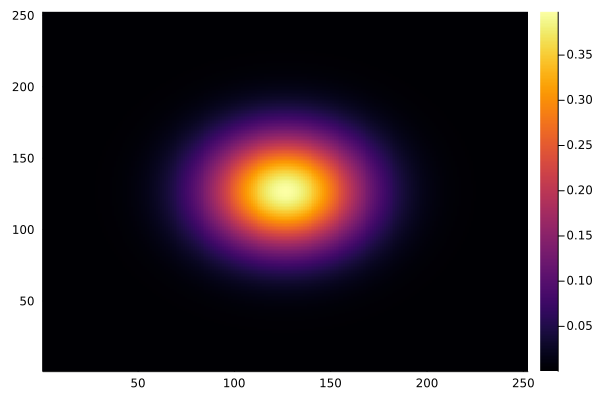

# ROCm-MPI
ROCm (-aware) MPI tests on AMD GPUs on following platforms:
- [Ault test system (MI50)](#cscs-ault)
- [LUMI-G supercomputer (MI250x)](#lumi-g)

## Multi AMD-GPU results
#### 1000 diffusion steps on 4 MI50 GPUs (CSCS' `Ault`)


#### 1000 diffusion steps on 4 MI250x GPUs (LUMI-G eap)



## Getting started

### CSCS Ault
1. First `salloc -n 4 -p amdvega -w ault20 --gres=gpu:4 -A c23 --time=04:00:00`. Then, upon cloning the ROCm-MPI repo:
2. `cd ROCm-MPI`
3. `srun -n 1 --mpi=pmix ./startup_ault.sh`
4. `cd scripts`
5. `srun -n 4 --mpi=pmix ./runme.sh` making sure to include the `setenv_ault.sh` in there
6. check the image saved in `/output`

:bulb: You can switch to non ROCM-aware MPI by switching comments in [`scripts/setenv_ault.sh`](scripts/setenv_ault.sh) L.12-19:

```bash
# ROCm-aware MPI
module load roc-ompi
export IGG_ROCMAWARE_MPI=1

# Standard MPI
# export PMIX_MCA_psec=native
# module load openmpi
# export IGG_ROCMAWARE_MPI=0
```

### LUMI-G
1. First `salloc -n 4 --gpus=4 -p eap -A project_465000139 --time=01:00:00`. Then, upon cloning the ROCm-MPI repo:
2. `cd ROCm-MPI`
3. `srun -n 1 ./startup_lumi.sh`
4. `cd scripts`
5. `srun -n 4 ./runme.sh` making sure to include the `setenv_lumi.sh` in there
6. check the image saved in `/output`

:bulb: You can switch to non ROCM-aware MPI by setting ENV vars to 0 in [`scripts/setenv_lumi.sh`](scripts/setenv_lumi.sh) L.11-12:

```
# ROCm-aware MPI set to 1, else 0
export MPICH_GPU_SUPPORT_ENABLED=1
export IGG_ROCMAWARE_MPI=1
```

:warning: For now the ROCm-aware support on LUMI-G is not working.

## Misc

> Uncomment the execution lines in `runme.sh` to switch from array programming (ap) to kernel programming (kp) or performance-oriented (perf) examples.

:warning: Make sure to modify the `scripts/setenv_[...].sh` script accordingly to the MPI and ROCm "modules" available on the machine you plan to run on.


## Dependences (dev)
The following package versions are currently needed to run ROCm (-aware) MPI tests successfully (see also in [`startup.sh`](startup.sh)):
- AMDGPU.jl v0.4.1 and above: https://github.com/JuliaGPU/AMDGPU.jl
- MPI.jl `#master`: https://github.com/JuliaParallel/MPI.jl#master
- ImplicitGlobalGrid.jl dev: https://github.com/luraess/ImplicitGlobalGrid.jl#amdgpu-0.4.0-compat
