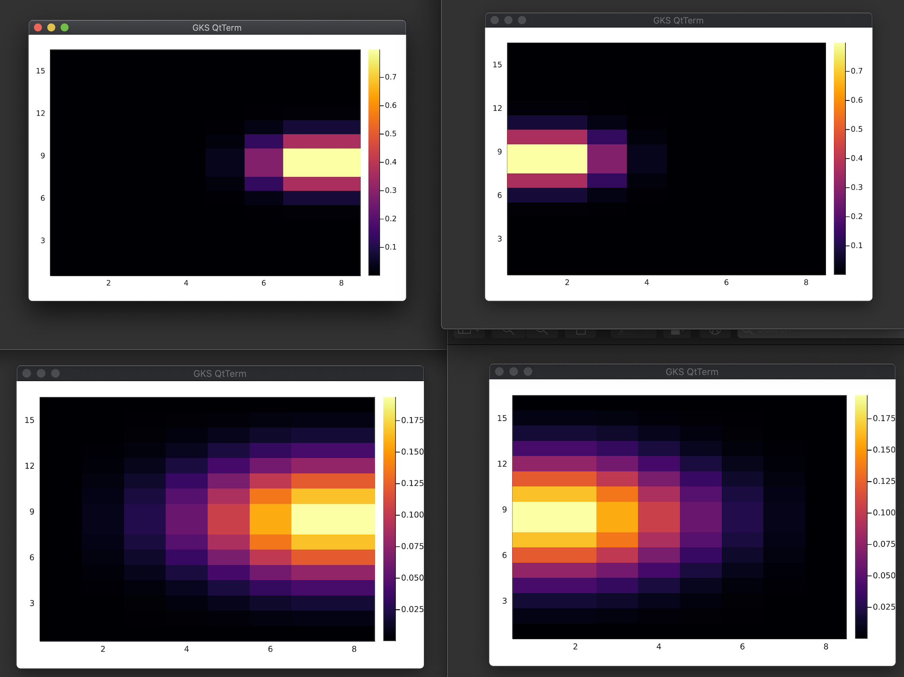

# ROCm-MPI
ROCm (-aware) MPI tests

### Proof of concept on CSCS's `ault` server

### 1000 diffusion steps on 4 MI50 GPUs

### Getting started
Upon cloning the ROCm-MPI repo:
1. `cd ROCm-MPI`
2. `srun -n 1 --mpi=pmix ./startup.sh`
3. `cd scripts`
4. `srun -n 4 --mpi=pmix ./runme.sh`
5. check the image saved in `/output`

#### The following package versions are currently needed to run ROCm (-aware) MPI tests successfully:
- AMDGPU.jl v0.3.5 and above: https://github.com/JuliaGPU/AMDGPU.jl
- MPI.jl dev: https://github.com/luraess/ImplicitGlobalGrid.jl#mpi-dev
- ImplicitGlobalGrid.jl dev: https://github.com/luraess/MPI.jl#rocmaware-dev
